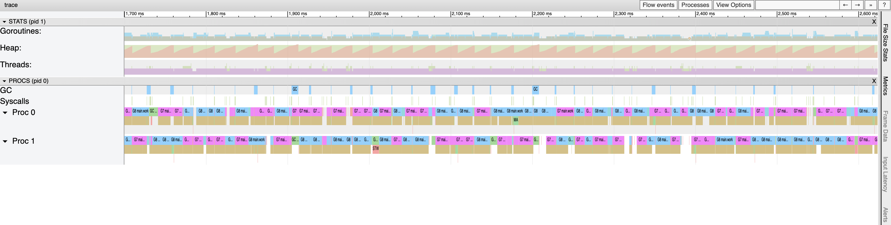
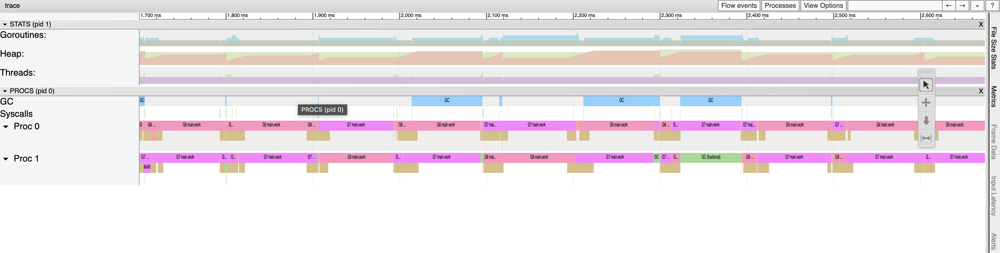
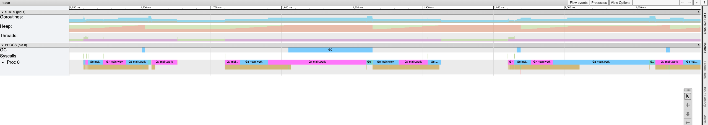

Recentemente, me deparei com um cenário em produção um tanto curioso. Ocorreu que, durante o monitoramento de uma aplicação, percebemos que ocorreram eventos de throttling de CPU e, coincidentemente, nesse período houve um aumento significativo da latência, seguido de um aumento do tempo de parada do GC (garbage collector). Bem, neste artigo compartilho como resolvemos esse evento e sua causa raiz.

> Para este artigo não ficar muito extenso, não irei abordar sobre o CFS e sua relação com CPU Limits (embora ele seja uma parte importante).

# CPU Limits

Os limites de CPU são uma parte específica do controle oferecido pelos cgroups. Eles permitem definir quanto tempo de CPU um grupo de processos pode utilizar durante um período determinado. Isso garante que processos importantes tenham acesso prioritário à CPU. Dessa forma, podemos especificar uma porcentagem da capacidade total de uma CPU; por exemplo, configurar um limite de 50% para um recurso significa que os processos desse recurso só poderão utilizar metade da capacidade da CPU, mesmo que haja mais recursos disponíveis e ociosos.

"Mas qual é a relação disso com o meu problema? Tudo!"

Ocorre que, enquanto os CPU limits consideram os cgroups, o runtime do Golang olha diretamente para os recursos do host da máquina, ignorando completamente as limitações impostas pelos CPU limits afetando a distribuição do tempo que é gerenciado pelo CFS, desse modo se você tiver uma màquina com 16 nucleos o runtime do Golang criará 16 thereads do SO independente dos limits de CPPU do cgroup, o runtime do Golang utilizará essa threads para agendar a execução das goroutines.

# Exemplos

>Para o exemplo abaixo estou rodando uma aplicação GO num container com 2 vCPU e 4GB de RAM.

1. Neste primeiro cenário temos uma aplicação rodando em um container sem NENHUM limit resource aplicado. Podemos observar que a aplicação está executando normalmente sem nenhum problema aparente (Se você não está familiarizado com essa interface veja este [Post]() que eu criei onde explico o que cada item representa).

    Legenda:
    - Proc 0 e 1 representam as 2 threads da maquina host do container.
    - Cores Azul e Rosa representam as coroutines (gorotinas) sendo executadas sob as threads.
    - Tarja bege abaixo das tarjas rosa e azul representam algumas chamadas syscall que a aplicação efetua

    


2. Veja o que acontece quando aplicamos um limit de cpu, neste caso usarei o seguinte comando: 
    `docker run --cpus 0.5 ...`
    Perceba que agora temos um intervalo de espaço maior entre as cores beges e se expandir a img conseguirá notar que a linha do tempo em alguns casos ultrapassam 50ms e que as tarjas beges executam em um periodo de 25ms e o restante desse tempo a goroutine esta parada fazendo nada e aqui está o throttling que mencionei!
    

    Como já mencionado isto ocorreu porque o runtime do Golang ignorou a configuração de limits de cpu aplicada no container, para resolver isto basta especificar a quantidade de CPU para o runtime do golang atráves da váriavel `GOMAXPROCS`

    >A variável GOMAXPROCS limita o número de threads do sistema operacional que podem executar código Go de nível de usuário simultaneamente. Não há limite para o número de threads que podem ser bloqueados em chamadas de sistema em nome do código Go; elas não contam para o limite GOMAXPROCS. A função GOMAXPROCS deste pacote consulta e altera o limite. [documentação oficial](https://pkg.go.dev/runtime)
    

3. Por ultimo, executei o mesmo container mas agora estou especificando a quantidade de CPU para o runtime do Golang atráves da váriavel `GOMAXPROCS`, este é o comando: `docker run -e GOMAXPROCS=1 --cpus 0.5` vejamos o resultado abaixo:
   

    Como podemos ver, agora a aplicação está sendo executada a cada 50ms sobe 1 thread do SO em seguida, não realiza nenhuma execução durante os 50 ms, exatamente como podemos esperar para esta cota.


# Conclusão

Se você executa uma aplicação Go dentro de um container com limites de CPU estabelecido é importante especificar esses limites para o runtime do Go ter a conciencia dessas limitações, existem alguns pacotes atualmente que fazem isto, um que conheço e utilizo é o [automaxprocs](https://github.com/uber-go/automaxprocs) que foi contruído e mantído pelo time de desenvolvimento da Uber.

uma outra maneira de configurar isto é setar `limits.cpu` no arquivo de configuração do kubernetes:

```yaml
env:
- name: GOMAXPROCS
  valueFrom:
    resourceFieldRef:
    resource: limits.cpu
```


